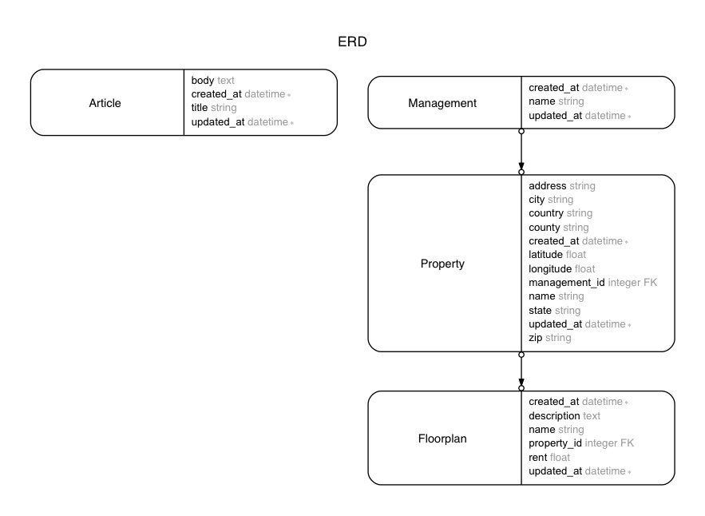

Elastic search sample app
===========

In this repository, I will study Elastic Search with Ruby on Rails.


## Environment

```
ruby 2.3.0
rail 5.0.0
postgresql
```


## Elasticsearch
- A powerful Full Text Search Engine based on Apache Lucene
- [Elasticsearch Scale Horizontally](https://www.elastic.co/guide/en/elasticsearch/guide/current/_scale_horizontally.html)
- Communicates with JSON
- Document-oriented
- [term suggester](https://www.elastic.co/guide/en/elasticsearch/reference/current/search-suggesters-term.html)


## Elasticsearch-related Ruby gems

#### Low-level
- [The official elasticsearch  gem](https://github.com/elastic/elasticsearch-ruby)
- [The elasticsearch-model  gem](https://github.com/elastic/elasticsearch-rails/tree/master/elasticsearch-model)

#### High-level
- [ankane/searchkick](https://github.com/ankane/searchkick)


## Structure

| RDB      | ES      ||
|---|---|---|
| database |  index  | each index can be split into multiple shards. |
| table    |  type   ||
| row      | document||
| column   |  field  ||


## Get started

```bash
bundle install
bundle exec rake db:migrate
bundle exec rake db:seed
```


## Models in this app




## Resources

- [Elasticsearch with Ruby on Rails](http://tutorials.pluralsight.com/ruby-ruby-on-rails/elasticsearch-with-ruby-on-rails)
- [elastic/elasticsearch-rails gem](https://github.com/elastic/elasticsearch-rails/tree/master/elasticsearch-model)
- [search-suggesters-term](https://www.elastic.co/guide/en/elasticsearch/reference/current/search-suggesters-term.html)
- [Full-Text Search in Rails Using Elasticsearch](https://code.tutsplus.com/articles/full-text-search-in-rails-using-elasticsearch--cms-22920) by Pedro Alonso
- [How to setup elasticsearch on Heroku?](http://stackoverflow.com/a/38657992/3837223)
- [https://github.com/aimee-ault/SearchkickSearch](https://github.com/aimee-ault/SearchkickSearch)
- [How to Use Searchkick and ElasticSearch in Your Rails App For Complex Search Indexing](http://aimeeault.com/2016/02/05/how-to-use-searchkick-and-elasticsearch-in-your-rails-app-for-complex-search-indexing/)
- [Elasticsearch with Ruby on Rails](http://tutorials.pluralsight.com/ruby-ruby-on-rails/elasticsearch-with-ruby-on-rails)
 by Itay Grudev
- [https://github.com/itay-grudev/es-tutorial](https://github.com/itay-grudev/es-tutorial)


## License

This work is licensed under a Creative Commons Attribution-NonCommercial-NoDerivatives 4.0 International License.
